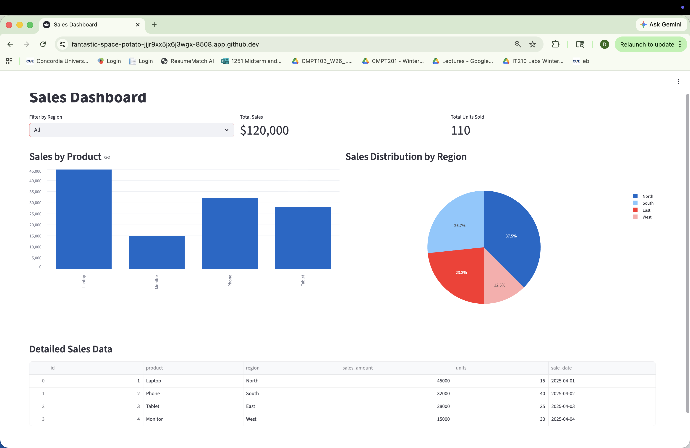
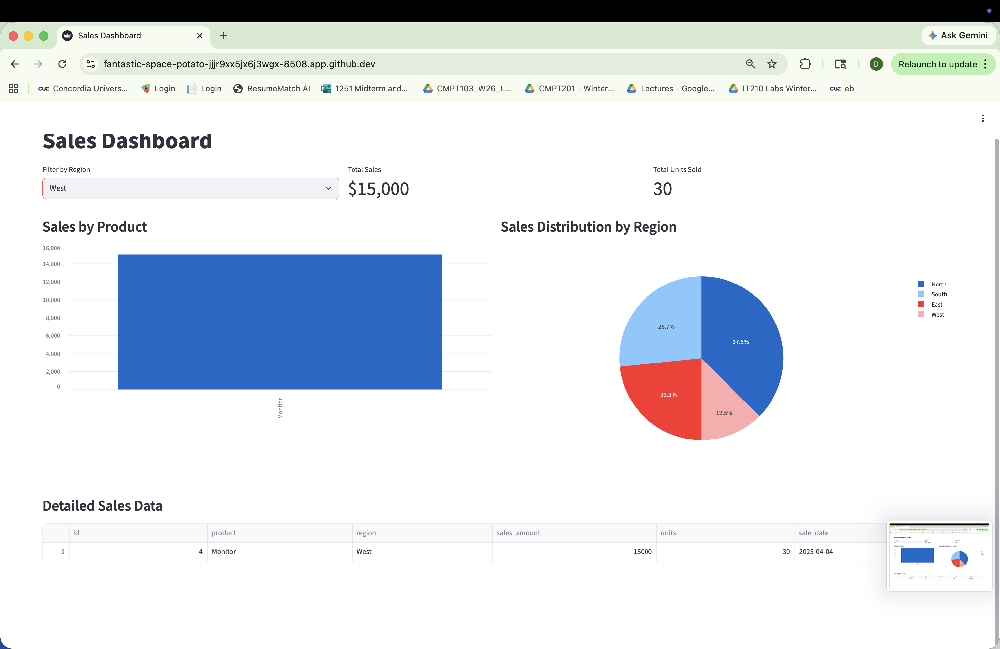
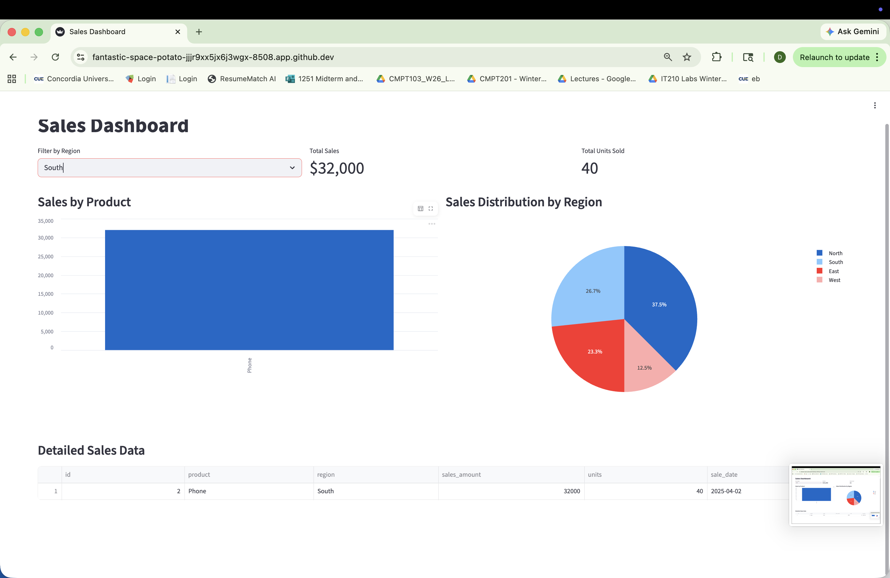

# Sales Dashboard Demo

Interactive web dashboard built to demonstrate database skills, data handling, and user-friendly visualizations.

### Tech Stack
- Python
- Streamlit
- Pandas
- SQLite
- Plotly

### Features
- Filter sales data by region
- Real-time updating metrics (Total Sales and Total Units)
- Interactive bar chart (Sales by Product)
- Pie chart (Sales Distribution by Region)
- Clean, responsive data table

### Screenshots

**Full Dashboard View**  

**Filtered by West Region**  

**Filtered by East Region**  

**Filtered by South Region**  

### How to Run Locally
1. `python -m venv venv`
2. `source venv/bin/activate`
3. `pip install streamlit pandas plotly`
4. `streamlit run app.py`

This project demonstrates working with SQL databases, data loading, filtering, and creating meaningful visualizations 